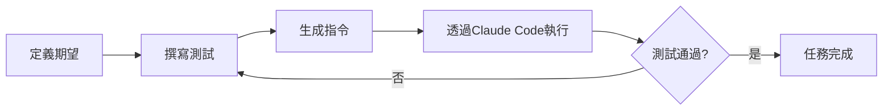
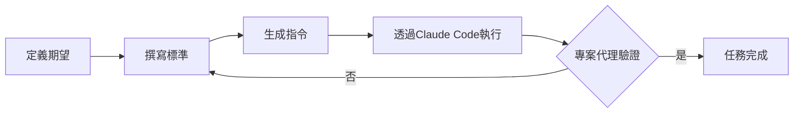

# AI驅動專案開發系統設計

## 執行摘要

一種革命性的AI輔助軟體開發方法，以單一智能專案代理取代複雜的多代理系統。使用者完全透過自然對話互動，系統則透過結構化的三階段生命週期處理專案管理、開發和迭代。

## 核心理念

### 單一代理架構
- **一個專案代理**管理專案所有面向
- 消除多代理協調的複雜性
- 維持一致的專案願景和決策

### 對話優先介面
- 所有使用者互動透過自然對話
- 不需要複雜的UI指令或設定
- 專案透過持續對話演進

### 循序執行模型
- 一次一個任務 - 確保專注和品質
- 無並行處理的複雜性
- 清晰的進度追蹤和可預測的結果

## 系統架構

### 元件概覽

```
使用者 ←→ 專案代理 ←→ 專案執行器 ←→ Claude Code
             ↓                    ↓              ↓
        CLAUDE.md          Database.sqlite   Git儲存庫
```

### 關鍵元件

#### 1. 專案代理
- **角色**：策略規劃者和對話管理者
- **職責**：
  - 透過對話進行需求收集
  - 建立和管理史詩、故事和任務
  - 定義驗收標準和驗證規則
  - 驗證非開發任務的成果
  - 在CLAUDE.md中維護專案脈絡
  - 決定故事之間的進展

#### 2. 專案執行器
- **角色**：持續輪詢執行引擎
- **職責**：
  - 輪詢待處理的指令
  - 分派指令給Claude Code
  - 處理重試邏輯和失敗恢復
  - 回報執行狀態給系統

#### 3. Claude Code整合
- **角色**：實際實作和驗證
- **職責**：
  - 執行來自專案執行器的指令
  - 執行開發任務的測試
  - 驗證非開發任務的標準
  - 執行Git操作

## 專案生命週期

### 第一階段：需求獲取

#### 目標
- 理解完整的專案願景
- 識別關鍵功能和限制
- 建立全面的專案提案

#### 流程
1. **探索對話**
   - 專案代理與使用者進行對話
   - 迭代收集想法和需求
   - 主動提出澄清問題

2. **提案開發**
   - 將需求綜合成結構化提案
   - 定義初始史詩層級
   - 規劃MVP範圍和方法

3. **持續改進**
   - 根據使用者回饋迭代提案
   - 改進MVP計畫直到使用者滿意
   - 等待明確的使用者批准才繼續

#### 轉換
- 使用者點擊按鈕進入MVP階段
- 專案代理完成需求定案
- 建立初始史詩和故事

### 第二階段：MVP開發

#### 目標
- 建立最小可行產品
- 建立核心功能
- 為迭代建立基礎

#### 流程
1. **史詩執行**
   - 根據優先順序處理史詩
   - 專案代理決定進展

2. **故事實作**
   - 史詩內循序執行故事
   - 一次一個活躍故事
   - 根據需要動態建立任務

3. **任務完成**
   - 遵循通用ATDD循環
   - 重試直到成功
   - 在故事/史詩層級追蹤代幣使用

#### 轉換
- MVP故事完成後自動轉換
- 或使用者透過按鈕啟動
- 進入持續整合階段

### 第三階段：持續整合

#### 目標
- 基於使用者回饋的迭代改進
- 處理所有MVP後的開發需求
- 維護和演進專案

#### 範圍
- **功能開發**：新能力
- **維護**：更新和改進
- **重構**：程式碼品質增強
- **錯誤修復**：問題解決

#### 流程
- 持續的對話驅動開發
- 相同的史詩→故事→任務結構
- 持續直到專案歸檔

## 執行模型

### 層級結構

```
史詩
├── 故事 1
│   ├── 任務 1.1
│   │   ├── 期望定義
│   │   ├── 測試/標準建立
│   │   ├── 指令生成
│   │   └── 驗證
│   └── 任務 1.2
└── 故事 2
    └── 任務 2.1
```

### 通用ATDD框架

#### 開發任務



#### 非開發任務



### 指令結構

每個指令包含：
- **預期成果**：清晰的成功定義
- **驗證標準**：如何驗證完成
- **高階指示**：需要做什麼（刻意模糊）

範例：
```json
{
  "expected_outcome": "建立使用者認證端點",
  "criteria": "POST /auth/login 在有效憑證時回傳JWT代幣",
  "directive": "實作安全登入功能"
}
```

## Git操作策略

### 檢查點系統
1. **執行前**：建立Git檢查點
2. **執行中**：在暫時狀態下工作
3. **驗證後**：
   - 成功 → 提交變更
   - 失敗 → 硬重設到檢查點

### 優點
- 操作總是可逆的
- 乾淨的Git歷史（無失敗嘗試）
- 實驗的信心

## 資料持久化

### CLAUDE.md
- **用途**：專案代理的工作記憶
- **內容**：
  - 當前階段和狀態
  - 活躍的史詩/故事/任務
  - 關鍵決策和脈絡
  - 對話歷史摘要

### 資料庫（`.codehive/database.sqlite`）
- **用途**：結構化專案資料
- **內容**：
  - 完整對話歷史
  - 史詩/故事/任務層級
  - 代幣使用追蹤
  - 執行歷史

## 代幣管理

### 追蹤層級
- **每個故事**：個別故事成本
- **每個史詩**：聚合史詩成本
- **專案總計**：完整專案消耗

### 使用優化
- 單一任務執行減少脈絡切換
- 重試循環分別追蹤
- 所有層級的清晰成本可見性

## 失敗處理

### Claude Code失敗
1. **自動重試**：多次嘗試直到限制
2. **升級**：如果無法恢復：
   - 暫停執行迴圈
   - 標記需要使用者注意
   - 等待使用者介入

### 任務失敗
- 無限ATDD重試循環
- 無人為重試限制
- 持續直到驗證通過

## 使用者體驗功能

### 進度視覺化
- 基於UI的進度顯示
- 即時執行狀態
- 代幣使用儀表板
- 史詩/故事/任務層級檢視

### 階段轉換
- 明確的按鈕控制
- 清晰的階段指示器
- 流暢的脈絡保存

### 歷史保存
- 所有完成的項目保持可見
- 決策的完整可追溯性
- 完整的開發時間軸

## 相對於多代理系統的優勢

### 簡單性
- 單一智能點
- 無代理協調開銷
- 統一的決策制定

### 一致性
- 一個連貫的專案願景
- 無衝突的代理意見
- 精簡的溝通

### 效率
- 減少代幣使用（無代理間溝通）
- 更快的執行（無協調延遲）
- 更清晰的責任歸屬

## 實作考量

### 所需基礎設施
- WebSocket用於即時更新
- SQLite用於可攜式資料儲存
- Git整合用於版本控制
- Claude Code子程序管理

### 擴展性因素
- 循序執行可能較慢但更可靠
- 代幣成本與專案複雜度成線性增長
- 資料庫隨對話歷史增長

### 安全考量
- 所有程式碼變更都是可逆的
- 提交前驗證
- 階段轉換需要使用者批准
- 隔離的執行環境

## 未來增強

### 潛在新增功能
- 多專案支援
- 常見模式的範本系統
- 從先前專案學習
- 協作功能（多使用者）

### 優化機會
- 相似任務的指令快取
- 可能的並行驗證
- 智能重試策略
- 脈絡壓縮技術

## 結論

此設計代表AI輔助開發的根本轉變，優先考慮簡單性、對話和可靠性，而非複雜的多代理協調。透過專注於單一智能專案代理和清晰的執行模型，系統提供了更直觀且可管理的AI驅動軟體開發方法。