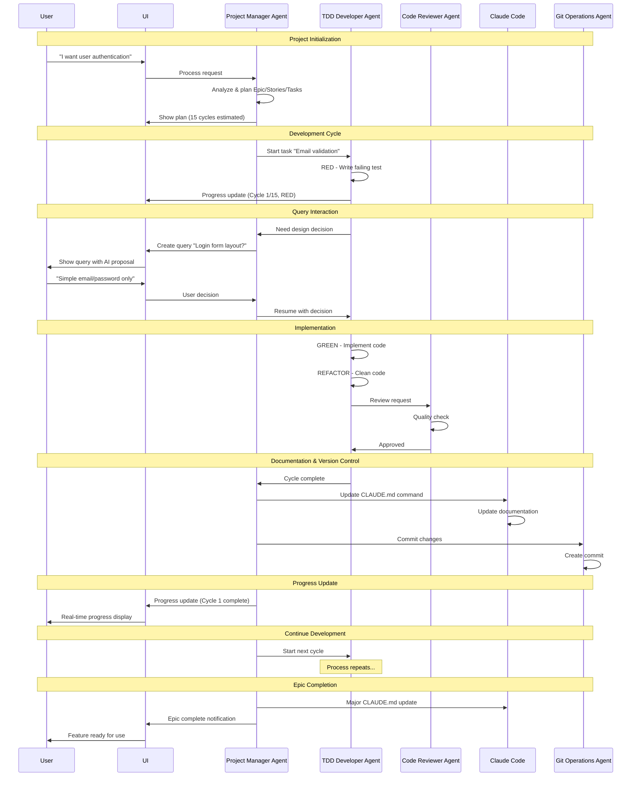
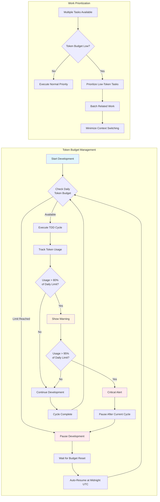
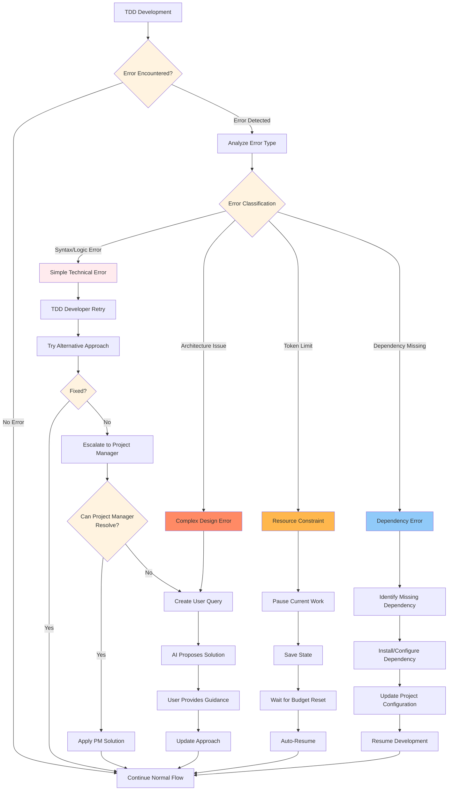
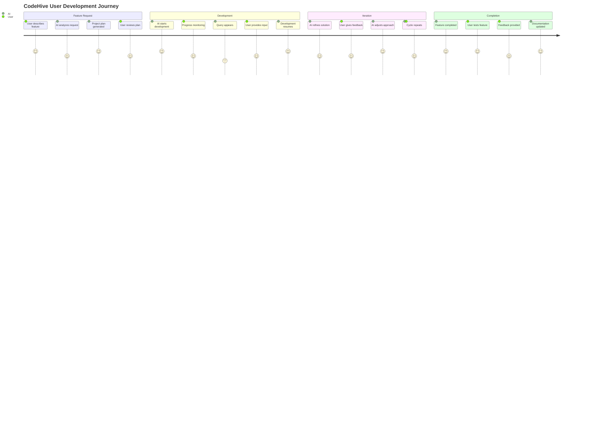

# CodeHive: AI-Native Development Platform
## Comprehensive Architecture Documentation

---

## Table of Contents
1. [Executive Summary](#executive-summary)
2. [Core Philosophy](#core-philosophy)
3. [System Architecture](#system-architecture)
4. [User Interface Design](#user-interface-design)
5. [AI Agent System](#ai-agent-system)
6. [Work Breakdown Structure](#work-breakdown-structure)
7. [Query System](#query-system)
8. [Resource Management](#resource-management)
9. [Progress Monitoring](#progress-monitoring)
10. [Technical Implementation](#technical-implementation)
11. [User Experience Flow](#user-experience-flow)
12. [API Design](#api-design)

---

## Executive Summary

CodeHive is an AI-native development platform that transforms how software is built by eliminating traditional project management overhead. Users simply describe what they want in natural language, and autonomous AI agents handle all aspects of planning, development, and delivery.

### Key Innovation Points
- **Zero Configuration**: No settings, forms, or manual project setup
- **Conversational Interface**: Pure text input for all user interactions
- **Autonomous Planning**: AI agents handle Sprint planning, story creation, and task breakdown
- **Predictable Progress**: TDD cycles as the only estimable unit of work
- **Interactive Decision Making**: Collaborative query system for design decisions
- **Real-Time Transparency**: Multi-perspective monitoring dashboards

---

## Core Philosophy

### "Just Text In → Working Software Out"

The fundamental principle is radical simplification of the user's role while maximizing AI autonomy and transparency.

#### User Responsibilities (Minimal)
```
✅ Describe desired features in natural language
✅ Answer design questions when asked
✅ Provide feedback on delivered functionality
❌ No project management
❌ No technical configuration
❌ No manual planning
```

#### AI Responsibilities (Complete)
```
✅ Analyze user requirements
✅ Plan Epic → Story → Task → TDD Cycle hierarchy
✅ Estimate work in predictable units (TDD cycles)
✅ Execute development using Test-Driven Development
✅ Manage dependencies and execution order
✅ Handle version control and code quality
✅ Ask clarifying questions when needed
✅ Provide real-time progress transparency
```

---

## System Architecture

### High-Level Architecture

```
User Text Input
       ↓
Project Manager Agent
       ↓
Epic Planning → Story Breakdown → Task Creation → TDD Cycles
       ↓                ↓              ↓            ↓
TDD Developer Agent ←→ Code Reviewer Agent ←→ Git Operations Agent
       ↓
Query Generation ←→ User Query Interface
       ↓
Multi-Perspective Monitoring Dashboards
```

### Agent Coordination Model

```typescript
interface AgentCoordination {
  hierarchy: {
    projectManager: {
      role: 'ORCHESTRATOR';
      responsibilities: [
        'Requirement analysis',
        'Work breakdown',
        'Agent coordination',
        'Query generation',
        'Progress tracking'
      ];
    };
    
    tddDeveloper: {
      role: 'IMPLEMENTER';
      responsibilities: [
        'Test writing',
        'Code implementation', 
        'Refactoring',
        'Technical decision making'
      ];
    };
    
    codeReviewer: {
      role: 'QUALITY_GUARDIAN';
      responsibilities: [
        'Code review',
        'Best practice enforcement',
        'Security validation',
        'Performance optimization'
      ];
    };
    
    gitOperations: {
      role: 'VERSION_CONTROLLER';
      responsibilities: [
        'Branch management',
        'Commit orchestration',
        'Merge conflict resolution',
        'Release management'
      ];
    };
  };
  
  communication: {
    protocol: 'EVENT_DRIVEN';
    coordination: 'CENTRALIZED_THROUGH_PROJECT_MANAGER';
    conflictResolution: 'ESCALATE_TO_USER_QUERY';
  };
}
```

---

## User Interface Design

### Minimal Interface Principle

The UI follows a **"Maximum Information, Minimum Complexity"** approach.

#### Core Components

```typescript
interface CoreUI {
  input: {
    component: 'TextInput';
    placeholder: 'Tell me what you want to build...';
    features: [
      'Natural language processing',
      'Auto-complete suggestions',
      'Command history',
      'Multi-line support'
    ];
  };
  
  monitoring: {
    tabs: [
      'Overview',    // High-level progress + urgent queries
      'Epics',       // Epic-level breakdown and status  
      'Stories',     // Story-level task progress
      'Development', // Live TDD cycle execution
      'Resources'    // Token usage and constraints
    ];
  };
  
  queries: {
    integration: 'EMBEDDED_IN_OVERVIEW';
    priority: 'HIGHEST_UI_PRIORITY';
    interaction: 'CONVERSATIONAL_THREAD';
  };
}
```

#### Navigation Structure

```
┌─────────────────────────────────────────────────────────────┐
│ [Overview] [Epics] [Stories] [Development] [Resources]      │
├─────────────────────────────────────────────────────────────┤
│                                                             │
│ 🚨 URGENT QUERIES SECTION (if any pending)                │
│ ┌─────────────────────────────────────────────────────────┐ │
│ │ ⚠️  2 urgent questions blocking development             │ │
│ │ [Answer Now]                                            │ │
│ └─────────────────────────────────────────────────────────┘ │
│                                                             │
│ 📊 PROJECT PROGRESS                                        │
│ ┌─────────────────────────────────────────────────────────┐ │
│ │ Epic: User Authentication (8/15 cycles complete)       │ │
│ │ Status: Paused - waiting for design input              │ │
│ │ Current: Password validation logic                      │ │
│ └─────────────────────────────────────────────────────────┘ │
│                                                             │
│ 💬 TEXT INPUT                                              │
│ ┌─────────────────────────────────────────────────────────┐ │
│ │ > Tell me what you want to build...                    │ │
│ └─────────────────────────────────────────────────────────┘ │
└─────────────────────────────────────────────────────────────┘
```

---

## AI Agent System

### Project Manager Agent

The orchestrating intelligence that handles all high-level planning and coordination.

```typescript
interface ProjectManagerAgent {
  capabilities: {
    requirementAnalysis: {
      input: 'Natural language user requests';
      processing: [
        'Intent extraction',
        'Feature identification', 
        'Technical requirement inference',
        'Scope boundary detection'
      ];
      output: 'Structured epic/story breakdown';
    };
    
    workBreakdown: {
      methodology: 'TOP_DOWN_DECOMPOSITION';
      levels: ['Epic', 'Story', 'Task', 'TDD_Cycle'];
      estimationUnit: 'TDD_CYCLES_ONLY';
      dependencyAnalysis: 'AUTOMATIC';
    };
    
    agentCoordination: {
      taskAssignment: 'BASED_ON_AGENT_CAPABILITIES';
      progressTracking: 'REAL_TIME';
      blockingResolution: 'QUERY_GENERATION';
    };
    
    queryGeneration: {
      triggers: [
        'Ambiguous requirements',
        'Design decisions needed',
        'Business logic clarification',
        'User experience choices'
      ];
      timing: 'EARLY_IN_EPIC_TO_PREVENT_REWORK';
      context: 'DETAILED_WITH_TECHNICAL_IMPLICATIONS';
    };
  };
  
  decisionMaking: {
    autonomous: [
      'Technical implementation details',
      'Code organization',
      'Testing strategies',
      'Performance optimizations'
    ];
    
    requiresUserInput: [
      'User experience flows',
      'Business rules',
      'Visual design preferences',
      'Data collection requirements',
      'Third-party integrations'
    ];
  };
}
```

### TDD Developer Agent

The implementation specialist focused on Test-Driven Development methodology.

```typescript
interface TDDDeveloperAgent {
  methodology: {
    cycleStructure: {
      RED: {
        action: 'Write failing test';
        criteria: 'Test must fail for the right reason';
        artifacts: ['Test files', 'Test cases'];
      };
      
      GREEN: {
        action: 'Write minimal code to pass test';
        criteria: 'Simplest possible implementation';
        artifacts: ['Implementation code', 'Passing tests'];
      };
      
      REFACTOR: {
        action: 'Improve code quality while maintaining tests';
        criteria: 'Better design without changing behavior';
        artifacts: ['Cleaned code', 'Maintained test coverage'];
      };
      
      REVIEW: {
        action: 'Code review and documentation';
        criteria: 'Meets quality standards';
        artifacts: ['Reviewed code', 'Documentation'];
      };
    };
    
    testingStrategy: {
      levels: ['Unit', 'Integration', 'End-to-End'];
      coverage: 'COMPREHENSIVE_BUT_NOT_EXCESSIVE';
      testTypes: [
        'Happy path scenarios',
        'Edge cases',
        'Error conditions',
        'Performance boundaries'
      ];
    };
  };
  
  codeGeneration: {
    principles: [
      'SOLID principles',
      'Clean code practices',
      'Functional programming where appropriate',
      'Security-first implementation'
    ];
    
    patterns: [
      'Repository pattern for data access',
      'Factory pattern for object creation',
      'Observer pattern for events',
      'Strategy pattern for algorithms'
    ];
  };
}
```

### Code Reviewer Agent

Quality assurance specialist ensuring all code meets standards.

```typescript
interface CodeReviewerAgent {
  reviewCriteria: {
    functionality: {
      correctness: 'Code does what it claims to do';
      completeness: 'All requirements implemented';
      edgeCases: 'Proper handling of edge cases';
    };
    
    quality: {
      readability: 'Clear variable names and structure';
      maintainability: 'Easy to modify and extend';
      performance: 'Efficient algorithms and data structures';
      security: 'No vulnerabilities or data exposure';
    };
    
    testing: {
      coverage: 'Adequate test coverage';
      testQuality: 'Tests are meaningful and maintainable';
      testTypes: 'Appropriate mix of test types';
    };
  };
  
  actions: {
    approve: 'Code meets all criteria';
    requestChanges: 'Specific improvements needed';
    escalateToUser: 'Design decision required';
  };
}
```

---

## Work Breakdown Structure

### Four-Level Hierarchy

The system uses a consistent four-level breakdown that maps from business goals to implementation units.

```typescript
interface WorkHierarchy {
  epic: {
    definition: 'Large business feature or capability';
    example: 'User Authentication System';
    scope: 'Delivers complete user value';
    duration: 'Multiple weeks to months';
    components: Story[];
  };
  
  story: {
    definition: 'Specific user-facing functionality';
    example: 'User can login with email and password';
    scope: 'Complete user workflow';
    duration: 'Several days to weeks';
    components: Task[];
    acceptanceCriteria: string[];
  };
  
  task: {
    definition: 'Technical component or service';
    example: 'Email validation component';
    scope: 'Discrete technical implementation';
    duration: 'Hours to days';
    components: TDDCycle[];
    type: 'FRONTEND' | 'BACKEND' | 'DATABASE' | 'API' | 'INTEGRATION';
  };
  
  tddCycle: {
    definition: 'Single test-driven implementation unit';
    example: 'Validate email format';
    scope: 'One testable behavior';
    duration: '30 minutes to 2 hours';
    phases: ['RED', 'GREEN', 'REFACTOR', 'REVIEW'];
    predictable: true;
  };
}
```

### Example Breakdown

```
Epic: E-commerce Shopping Cart System
├── Story: User can add items to cart
│   ├── Task: Cart item validation
│   │   ├── TDD Cycle: Validate item exists in inventory
│   │   ├── TDD Cycle: Check item availability
│   │   └── TDD Cycle: Validate quantity limits
│   ├── Task: Cart storage service
│   │   ├── TDD Cycle: Store cart in localStorage
│   │   ├── TDD Cycle: Handle storage quota exceeded
│   │   └── TDD Cycle: Sync cart across browser tabs
│   └── Task: Cart UI component
│       ├── TDD Cycle: Render cart items list
│       ├── TDD Cycle: Handle add item interaction
│       └── TDD Cycle: Show cart item count badge
├── Story: User can modify cart contents
│   ├── Task: Quantity adjustment
│   ├── Task: Item removal
│   └── Task: Cart clearing
└── Story: User can proceed to checkout
    ├── Task: Cart validation before checkout
    ├── Task: Checkout button state management
    └── Task: Cart persistence during checkout
```

### Dependency Management

```typescript
interface DependencySystem {
  types: {
    sequential: 'Task B cannot start until Task A completes';
    parallel: 'Tasks can execute simultaneously';
    conditional: 'Task execution depends on user decision';
  };
  
  resolution: {
    automatic: 'AI determines optimal execution order';
    blocking: 'Work pauses when dependencies unmet';
    notification: 'User informed of blocked work';
  };
  
  visualization: {
    dependencyGraph: 'Visual representation of task relationships';
    criticalPath: 'Longest chain of dependent tasks';
    parallelOpportunities: 'Tasks that can run concurrently';
  };
}
```

---

## Query System

The query system enables collaborative decision-making between AI agents and users while maintaining development momentum.

### Query Types and Triggers

```typescript
interface QuerySystem {
  types: {
    DESIGN_QUESTION: {
      trigger: 'UI/UX decisions needed';
      example: 'Should cart be dropdown or separate page?';
      urgency: 'HIGH_IF_BLOCKING_MULTIPLE_CYCLES';
    };
    
    BUSINESS_LOGIC: {
      trigger: 'Business rule clarification needed';
      example: 'What happens after 3 failed login attempts?';
      urgency: 'MEDIUM';
    };
    
    TECHNICAL_APPROVAL: {
      trigger: 'Significant technical decision';
      example: 'Refactor auth module for better security?';
      urgency: 'LOW_BUT_IMPORTANT';
    };
    
    INTEGRATION_CHOICE: {
      trigger: 'Third-party service selection';
      example: 'Use Stripe or PayPal for payments?';
      urgency: 'HIGH_IF_BLOCKING_PAYMENT_FEATURES';
    };
  };
  
  lifecycle: {
    creation: 'AI agent encounters decision point';
    proposal: 'AI provides suggested solution with reasoning';
    discussion: 'User comments, AI refines proposal';
    approval: 'User approves final proposal';
    implementation: 'Blocked work resumes with decision';
  };
}
```

### Interactive Query Flow

```typescript
interface QueryFlow {
  step1_AIProposal: {
    content: 'Initial AI suggestion with technical reasoning';
    format: {
      proposal: string;
      reasoning: string;
      alternatives: string[];
      impact: 'Technical implications and tradeoffs';
    };
  };
  
  step2_UserComment: {
    action: 'User provides feedback or modifications';
    types: [
      'Accept as-is',
      'Request specific changes', 
      'Reject and suggest alternative',
      'Ask for more information'
    ];
  };
  
  step3_AIRefinement: {
    action: 'AI updates proposal based on feedback';
    process: [
      'Analyze user feedback',
      'Generate refined proposal',
      'Explain changes made',
      'Highlight remaining questions'
    ];
  };
  
  step4_Iteration: {
    continuation: 'Repeat until user approval';
    safeguards: [
      'Maximum 5 iterations before escalation',
      'Timeout after 24 hours with default choice',
      'Option to skip and use AI recommendation'
    ];
  };
  
  step5_Implementation: {
    action: 'Resume blocked work with approved decision';
    tracking: [
      'Record decision for future reference',
      'Update user preference patterns',
      'Apply decision to similar future situations'
    ];
  };
}
```

### Query UI Components

```typescript
interface QueryUI {
  queryCard: {
    layout: {
      header: {
        question: string;
        status: 'PENDING' | 'IN_DISCUSSION' | 'APPROVED';
        priority: 'HIGH' | 'MEDIUM' | 'LOW';
        blockedWork: string[];
      };
      
      proposalSection: {
        currentProposal: string;
        aiReasoning: string;
        alternatives?: string[];
        technicalImpact: string;
      };
      
      discussionThread: {
        comments: Array<{
          user: string;
          ai?: string;
          timestamp: Date;
        }>;
        versionHistory: QueryProposal[];
      };
      
      actions: {
        approve: 'Accept current proposal';
        comment: 'Add feedback or request changes';
        reject: 'Reject and start over';
        skip: 'Use AI default choice';
      };
    };
  };
  
  queryDashboard: {
    overview: {
      urgentQueries: number;
      pendingQueries: number;
      inDiscussion: number;
      avgResponseTime: string;
    };
    
    workImpact: {
      blockedCycles: number;
      estimatedDelay: string;
      affectedFeatures: string[];
    };
  };
}
```

### Example Query Interaction

```
AI: "For the shopping cart, I propose:
     - Cart items persist in localStorage for 7 days
     - Cart slides out from right side
     - Maximum 50 items per cart
     - Auto-calculate shipping based on total weight
     
     This provides good UX while preventing abuse."

User: "Good but change a few things:
       - Persist indefinitely, not just 7 days
       - Slide from left side instead
       - 100 items max, not 50"

AI: "Updated proposal:
     - Cart items persist indefinitely in localStorage
     - Cart slides out from left side  
     - Maximum 100 items per cart
     - Auto-calculate shipping based on total weight
     
     Left side might conflict with navigation menu. Should I adjust?"

User: "You're right, keep it on the right. Everything else looks good."

AI: "Final proposal:
     - Cart items persist indefinitely in localStorage
     - Cart slides out from RIGHT side
     - Maximum 100 items per cart  
     - Auto-calculate shipping based on total weight"

User: "✓ Approved"
```

---

## Resource Management

### Token-Based Reality

Unlike traditional project management with abstract story points, CodeHive operates on the actual constraint of AI development: token consumption.

```typescript
interface ResourceManagement {
  tokenTracking: {
    realtime: {
      currentUsage: number;
      dailyLimit: number;
      monthlyLimit: number;
      remainingToday: number;
      remainingThisMonth: number;
    };
    
    breakdown: {
      byAgent: Record<AgentType, number>;
      byEpic: Record<string, number>;
      byTask: Record<string, number>;
      byCycle: Array<{cycleId: string, tokens: number}>;
    };
    
    projection: {
      burnRate: number; // tokens per hour
      estimatedCyclesRemaining: number;
      estimatedTimeToLimit: string;
    };
  };
  
  budgetManagement: {
    limits: {
      dailyHardLimit: number;
      weeklyGuideline: number;
      monthlyBudget: number;
      emergencyReserve: number;
    };
    
    alerts: {
      warning: 'At 80% of daily limit';
      critical: 'At 95% of daily limit';
      blocked: 'Daily limit reached - work paused';
    };
    
    behavior: {
      onLimitReached: 'PAUSE_UNTIL_RESET';
      resetTime: 'DAILY_AT_MIDNIGHT_UTC';
      resumption: 'AUTOMATIC_WHEN_BUDGET_AVAILABLE';
    };
  };
  
  workScheduling: {
    priority: 'Complete current TDD cycle before pausing';
    batching: 'Group related cycles to minimize context switching';
    optimization: 'Prefer less token-intensive tasks when budget low';
  };
}
```

### No Predictive Estimation

```typescript
interface NoPredictiveEstimation {
  why: [
    'Token usage varies wildly based on code complexity',
    'Debug cycles can spiral unpredictably',
    'Context switching costs are variable',
    'Error handling requirements are unknown upfront'
  ];
  
  instead: {
    realTimeTracking: 'Show actual usage as it happens';
    honestProgress: 'Report what actually got done';
    transparentBlocking: 'Clearly communicate when and why work stops';
    resumptionClarity: 'Exact time when work can resume';
  };
  
  userExperience: {
    good: 'Login feature 80% complete, paused due to daily token limit, resuming tomorrow at 9 AM';
    bad: 'Login feature will take 15 story points and complete in 3 sprints';
  };
}
```

---

## Progress Monitoring

### Multi-Perspective Dashboards

Each monitoring view serves different user needs and levels of detail.

```typescript
interface MonitoringSystem {
  overviewTab: {
    purpose: 'High-level project status and urgent actions';
    content: {
      urgentQueries: 'Questions that block progress';
      projectProgress: 'Epic completion percentages';
      currentWork: 'What AI is doing right now';
      resourceStatus: 'Token usage and constraints';
      recentActivity: 'Latest AI actions and decisions';
    };
    updateFrequency: 'REAL_TIME';
  };
  
  epicsTab: {
    purpose: 'Epic-level planning and progress';
    content: {
      epicList: 'All epics with completion status';
      storyBreakdown: 'Stories within each epic';
      dependencyGraph: 'Inter-epic dependencies';
      timeline: 'Estimated epic completion order';
    };
    updateFrequency: 'WHEN_EPIC_STATUS_CHANGES';
  };
  
  storiesTab: {
    purpose: 'Story-level task management';
    content: {
      storyDetails: 'Acceptance criteria and progress';
      taskBoard: 'Kanban-style task visualization';
      testCoverage: 'Quality metrics per story';
      blockers: 'Dependencies blocking story completion';
    };
    updateFrequency: 'WHEN_TASK_STATUS_CHANGES';
  };
  
  developmentTab: {
    purpose: 'Live development monitoring';
    content: {
      currentCycle: 'Active TDD cycle details';
      liveActivity: 'Real-time agent actions';
      codeChanges: 'Files being modified';
      testResults: 'Test execution results';
    };
    updateFrequency: 'REAL_TIME_DURING_DEVELOPMENT';
  };
  
  resourcesTab: {
    purpose: 'Budget and performance monitoring';
    content: {
      tokenUsage: 'Usage charts and breakdowns';
      performance: 'Cycles per day, success rates';
      blockers: 'Issues requiring attention';
      scheduling: 'Work timeline and pauses';
    };
    updateFrequency: 'CONTINUOUS';
  };
}
```

### Progress Indicators

```typescript
interface ProgressIndicators {
  epic: {
    metric: 'Completed stories / Total stories';
    visual: 'Progress ring with story breakdown';
    status: 'PLANNING' | 'IN_PROGRESS' | 'COMPLETED' | 'BLOCKED';
  };
  
  story: {
    metric: 'Completed tasks / Total tasks';
    visual: 'Task board with status columns';
    status: 'PENDING' | 'IN_PROGRESS' | 'TESTING' | 'COMPLETED';
  };
  
  task: {
    metric: 'Completed TDD cycles / Total cycles';
    visual: 'Cycle list with phase indicators';
    status: 'PENDING' | 'RED' | 'GREEN' | 'REFACTOR' | 'REVIEW' | 'COMPLETE';
  };
  
  overall: {
    metric: 'Total completed cycles / Total estimated cycles';
    visual: 'Comprehensive progress dashboard';
    breakdown: {
      completed: number;
      inProgress: number;
      blocked: number;
      remaining: number;
    };
  };
}
```

---

## Technical Implementation

### Database Schema

```typescript
interface DatabaseSchema {
  epics: {
    id: string;
    title: string;
    description: string;
    status: EpicStatus;
    createdAt: Date;
    completedAt?: Date;
    estimatedCycles: number;
  };
  
  stories: {
    id: string;
    epicId: string;
    title: string;
    description: string;
    acceptanceCriteria: string[];
    status: StoryStatus;
    createdAt: Date;
    completedAt?: Date;
  };
  
  tasks: {
    id: string;
    storyId: string;
    title: string;
    description: string;
    type: TaskType;
    dependencies: string[];
    status: TaskStatus;
    createdAt: Date;
    completedAt?: Date;
  };
  
  tddCycles: {
    id: string;
    taskId: string;
    goal: string;
    tests: string[];
    phase: TDDPhase;
    startedAt?: Date;
    completedAt?: Date;
    tokensUsed: number;
    artifacts: {
      testFiles: string[];
      implementationFiles: string[];
      commits: string[];
    };
  };
  
  queries: {
    id: string;
    type: QueryType;
    question: string;
    context: string;
    proposals: QueryProposal[];
    comments: QueryComment[];
    status: QueryStatus;
    blockingWork: string[];
    createdAt: Date;
    resolvedAt?: Date;
  };
  
  tokenUsage: {
    id: string;
    agentType: AgentType;
    operation: string;
    tokensUsed: number;
    timestamp: Date;
    epicId?: string;
    storyId?: string;
    taskId?: string;
    cycleId?: string;
  };
}
```

### Agent Communication Protocol

```typescript
interface AgentCommunication {
  eventBus: {
    events: {
      WORK_ASSIGNED: {
        from: 'PROJECT_MANAGER';
        to: AgentType;
        payload: { taskId: string, instructions: string };
      };
      
      WORK_COMPLETED: {
        from: AgentType;
        to: 'PROJECT_MANAGER';
        payload: { taskId: string, artifacts: Artifact[] };
      };
      
      QUERY_NEEDED: {
        from: AgentType;
        to: 'PROJECT_MANAGER';
        payload: { question: string, context: string, blockingWork: string[] };
      };
      
      DECISION_MADE: {
        from: 'PROJECT_MANAGER';
        to: AgentType;
        payload: { queryId: string, decision: string };
      };
    };
  };
  
  coordination: {
    workflow: 'EVENT_DRIVEN_STATE_MACHINE';
    errorHandling: 'ESCALATE_TO_PROJECT_MANAGER';
    concurrency: 'SINGLE_ACTIVE_CYCLE_PER_TASK';
  };
}
```

---

## Complete Project Lifecycle Flow

### Full Development Flow Diagram

```mermaid
graph TB
    %% User Input Phase
    UserInput["User Input: I want user authentication"]
    
    %% Project Manager Analysis
    PM_Analysis["Project Manager Agent<br/>Analyze requirements<br/>Extract features<br/>Identify scope"]
    
    %% Work Breakdown
    Epic_Creation["Create Epic<br/>User Authentication System"]
    Story_Breakdown["Break into Stories<br/>User registration<br/>User login<br/>Password reset"]
    Task_Planning["Plan Tasks<br/>Email validation<br/>Password hashing<br/>JWT tokens"]
    TDD_Estimation["Estimate TDD Cycles<br/>15 cycles total"]
    
    %% Development Execution
    Start_Development["Start Development"]
    Current_Task["Select Next Task<br/>Email validation"]
    
    %% TDD Cycle
    TDD_RED["RED Phase<br/>Write failing test"]
    TDD_GREEN["GREEN Phase<br/>Implement code"]
    TDD_REFACTOR["REFACTOR Phase<br/>Clean up code"]
    TDD_REVIEW["REVIEW Phase<br/>Code review"]
    
    %% Decision Points
    Need_Query{"Design Decision<br/>Needed?"}
    Create_Query["Create Query<br/>How should login form look?"]
    AI_Proposal["AI Proposal<br/>Simple form with email/password"]
    
    %% User Interaction
    User_Response{"User Response"}
    Comment["User Comments<br/>Make it simple, add remember me"]
    AI_Refine["AI Refines Proposal<br/>Updated with remember me option"]
    User_Approve["User Approves<br/>Final proposal"]
    
    %% Progress & Updates
    Cycle_Complete["Cycle Complete"]
    Update_CLAUDE["Update CLAUDE.md<br/>via Claude Code command"]
    Progress_Update["Update Progress<br/>UI dashboards"]
    
    %% Resource Management
    Check_Budget{"Check Token Budget"}
    Budget_OK["Budget Available"]
    Budget_Limit["Budget Limit Reached<br/>Pause until reset"]
    
    %% Completion Checks
    More_Cycles{"More Cycles<br/>in Task?"}
    More_Tasks{"More Tasks<br/>in Story?"}
    More_Stories{"More Stories<br/>in Epic?"}
    
    %% Epic Completion
    Epic_Complete["Epic Complete"]
    Major_Update["Major CLAUDE.md Update"]
    User_Delivery["Deliver to User"]
    
    %% Error Handling
    Error_Detected{"Error Detected?"}
    Simple_Error["Simple Technical Error<br/>Retry with different approach"]
    Complex_Error["Complex Design Issue<br/>Create query for user input"]
    
    %% Flow Connections
    UserInput --> PM_Analysis
    PM_Analysis --> Epic_Creation
    Epic_Creation --> Story_Breakdown
    Story_Breakdown --> Task_Planning
    Task_Planning --> TDD_Estimation
    TDD_Estimation --> Start_Development
    
    Start_Development --> Current_Task
    Current_Task --> Check_Budget
    Check_Budget --> Budget_OK
    Check_Budget --> Budget_Limit
    Budget_Limit -.-> Budget_OK
    
    Budget_OK --> TDD_RED
    TDD_RED --> Need_Query
    
    Need_Query -->|No| TDD_GREEN
    Need_Query -->|Yes| Create_Query
    Create_Query --> AI_Proposal
    AI_Proposal --> User_Response
    
    User_Response -->|Comment| Comment
    User_Response -->|Approve| User_Approve
    Comment --> AI_Refine
    AI_Refine --> User_Response
    User_Approve --> TDD_GREEN
    
    TDD_GREEN --> Error_Detected
    Error_Detected -->|No| TDD_REFACTOR
    Error_Detected -->|Simple| Simple_Error
    Error_Detected -->|Complex| Complex_Error
    Simple_Error --> TDD_GREEN
    Complex_Error --> Create_Query
    
    TDD_REFACTOR --> TDD_REVIEW
    TDD_REVIEW --> Cycle_Complete
    Cycle_Complete --> Update_CLAUDE
    Update_CLAUDE --> Progress_Update
    
    Progress_Update --> More_Cycles
    More_Cycles -->|Yes| Current_Task
    More_Cycles -->|No| More_Tasks
    More_Tasks -->|Yes| Current_Task
    More_Tasks -->|No| More_Stories
    More_Stories -->|Yes| Story_Breakdown
    More_Stories -->|No| Epic_Complete
    
    Epic_Complete --> Major_Update
    Major_Update --> User_Delivery
    
    %% Styling
    classDef userAction fill:#e1f5fe
    classDef aiAgent fill:#f3e5f5
    classDef tddPhase fill:#e8f5e8
    classDef decision fill:#fff3e0
    classDef completion fill:#e0f2f1
    classDef error fill:#ffebee
    
    class UserInput,Comment,User_Response,User_Approve userAction
    class PM_Analysis,AI_Proposal,AI_Refine aiAgent
    class TDD_RED,TDD_GREEN,TDD_REFACTOR,TDD_REVIEW tddPhase
    class Need_Query,User_Response,Check_Budget,More_Cycles,More_Tasks,More_Stories,Error_Detected decision
    class Cycle_Complete,Epic_Complete,User_Delivery completion
    class Simple_Error,Complex_Error,Budget_Limit error
```



### Agent Interaction Flow



### Resource Management Flow



### Error Handling & Recovery Flow



### User Experience Flow



---

## API Design

### RESTful Endpoints

```typescript
// Input Processing
POST /api/input
{
  "message": "I want a shopping cart with PayPal integration",
  "conversationId": "optional-thread-id"
}
Response: {
  "acknowledged": true,
  "epic": {
    "id": "epic-123",
    "title": "Shopping Cart System",
    "estimatedCycles": 25,
    "estimatedCompletion": "2024-02-15"
  }
}

// Progress Monitoring
GET /api/progress/overview
Response: {
  "epics": [
    {
      "id": "epic-123",
      "title": "Shopping Cart System", 
      "progress": 0.32,
      "status": "IN_PROGRESS",
      "currentWork": "Testing cart item validation"
    }
  ],
  "queries": [
    {
      "id": "query-456",
      "question": "Should cart items persist across browser sessions?",
      "priority": "HIGH",
      "blockedCycles": 3
    }
  ],
  "resources": {
    "tokensUsed": 45000,
    "tokensRemaining": 15000,
    "status": "ACTIVE"
  }
}

// Query Management  
POST /api/queries/query-456/comment
{
  "comment": "Yes, save cart items for 30 days in localStorage"
}
Response: {
  "updated": true,
  "newProposal": "Updated proposal based on your feedback..."
}

POST /api/queries/query-456/approve  
{
  "proposal": "Save cart items in localStorage for 30 days with fallback to session storage"
}
Response: {
  "approved": true,
  "resumedWork": ["cart-storage-cycle", "cart-persistence-cycle"]
}
```

### WebSocket Events

```typescript
// Real-time progress updates
interface WebSocketEvents {
  'progress_update': {
    epicId: string;
    progress: number;
    completedCycles: number;
    totalCycles: number;
  };
  
  'cycle_started': {
    cycleId: string;
    goal: string;
    phase: 'RED' | 'GREEN' | 'REFACTOR' | 'REVIEW';
    estimatedDuration: number;
  };
  
  'cycle_completed': {
    cycleId: string;
    artifacts: string[];
    testsAdded: number;
    tokensUsed: number;
  };
  
  'query_created': {
    queryId: string;
    question: string;
    priority: 'HIGH' | 'MEDIUM' | 'LOW';
    blockedWork: string[];
  };
  
  'work_blocked': {
    reason: 'QUERY_PENDING' | 'BUDGET_LIMIT' | 'DEPENDENCY';
    blockedCycles: string[];
    estimatedDelay: string;
  };
  
  'work_resumed': {
    reason: 'QUERY_ANSWERED' | 'BUDGET_RESET' | 'DEPENDENCY_RESOLVED';
    resumedCycles: string[];
  };
  
  'token_usage': {
    agentType: string;
    tokensUsed: number;
    operation: string;
    remainingBudget: number;
  };
}
```

---

## Implementation Roadmap

### Phase 1: Core Infrastructure (4-6 weeks)
- [ ] Basic text input processing
- [ ] Project Manager agent with Epic/Story/Task breakdown
- [ ] Database schema and models
- [ ] Simple progress tracking
- [ ] Token usage monitoring

### Phase 2: TDD Development System (6-8 weeks)
- [ ] TDD Developer agent implementation
- [ ] RED-GREEN-REFACTOR-REVIEW cycle execution
- [ ] Code Reviewer agent
- [ ] Git Operations agent
- [ ] Real-time progress updates

### Phase 3: Query System (4-6 weeks)
- [ ] Query generation and management
- [ ] Interactive proposal refinement
- [ ] Comment/approval workflow
- [ ] Query-based work blocking/resuming

### Phase 4: Advanced Monitoring (3-4 weeks)
- [ ] Multi-perspective dashboards
- [ ] WebSocket real-time updates
- [ ] Advanced progress visualization
- [ ] Resource management UI

### Phase 5: Polish & Optimization (2-3 weeks)
- [ ] Performance optimization
- [ ] Error handling improvements
- [ ] User experience refinements
- [ ] Documentation and testing

---

## CLAUDE.md Auto-Update System

### Overview

After each task completion, epic finish, or query resolution, AI agents must update the project's CLAUDE.md file to maintain current context for future development. This is done by **instructing Claude Code to update CLAUDE.md** rather than agents updating it directly.

### Update Triggers

```typescript
interface CLAUDEMDUpdateTriggers {
  afterTaskCompletion: {
    trigger: 'TDD cycle or task completes';
    updates: [
      'New features implemented',
      'Architecture changes',
      'Dependencies added',
      'Testing patterns established',
      'Known issues or limitations'
    ];
  };
  
  afterEpicCompletion: {
    trigger: 'Epic reaches completion';
    updates: [
      'Major feature additions',
      'Project structure changes',
      'New development patterns',
      'Updated tech stack components',
      'Revised project status'
    ];
  };
  
  afterQueryResolution: {
    trigger: 'User approves query decision';
    updates: [
      'Design decisions made',
      'Business rules clarified',
      'User preferences recorded',
      'Architecture constraints'
    ];
  };
}
```

### Claude Code Command Process

#### Step 1: Agent Completes Work
```typescript
class ProjectManagerAgent {
  async onTaskComplete(task: Task, artifacts: Artifact[]) {
    // Generate update command for Claude Code
    const updateCommand = this.generateCLAUDEMDUpdateCommand(task, artifacts);
    
    // Send command to Claude Code
    await this.executeClaudeCodeCommand(updateCommand);
  }
}
```

#### Step 2: Generate Update Command
```typescript
private generateCLAUDEMDUpdateCommand(task: Task, artifacts: Artifact[]): string {
  return `
Please update CLAUDE.md with the following completed work:

**Completed**: ${task.title}

**Implementation Details**:
${this.extractImplementationDetails(artifacts)}

**New Patterns Established**:
${this.extractCodePatterns(artifacts)}

**Dependencies Added**:
${this.extractDependencies(artifacts)}

**Testing Approach**:
${this.extractTestingInfo(artifacts)}

Please update the relevant sections of CLAUDE.md to reflect this work.
  `;
}
```

### Example Update Commands

#### After TDD Cycle Completion
```
Please update CLAUDE.md with the following completed work:

**Completed**: Email validation component in lib/validation/email.ts

**What was implemented**:
- Email format validation using regex
- Domain existence checking via DNS lookup
- Rate limiting for DNS lookups (100 requests/hour)
- Comprehensive test suite with 15 test cases
- Error handling for network failures

**New dependencies added**:
- dns module for domain validation
- joi for validation schema

**Usage pattern established**:
```typescript
import { validateEmail } from '@/lib/validation/email';
const result = await validateEmail('user@example.com');
```

**Testing approach**:
- Unit tests for format validation
- Integration tests for DNS lookup
- Mocked network calls for reliable testing

Please update the relevant sections of CLAUDE.md to reflect this new component and patterns.
```

#### After Query Resolution
```
Please update CLAUDE.md with the following user decision:

**Query Resolved**: "Should cart items persist across browser sessions?"

**User Decision**: Save cart items in localStorage for 30 days

**Implemented Solution**:
- Primary storage: localStorage with 30-day expiry
- Fallback: sessionStorage if localStorage unavailable
- Cross-tab sync: storage events for real-time updates
- Auto-cleanup: removes expired items on app load

**User Preferences Identified**:
- Prefers local storage over server storage for privacy
- 30-day retention is acceptable timeframe
- Cross-tab synchronization is important for UX
- Always wants fallback options for reliability

Please update CLAUDE.md to document this decision and the user's privacy preferences.
```

#### After Epic Completion
```
Please update CLAUDE.md with the completion of a major epic:

**Epic Completed**: User Authentication System

**Features Implemented**:
- User registration with email verification
- Email/password login with JWT tokens
- Google OAuth integration
- Password reset functionality
- Account lockout protection

**Architecture Established**:
- JWT strategy: 15min access tokens, 7-day refresh tokens
- Password hashing: bcrypt with 12 salt rounds
- OAuth: Google OAuth 2.0 with PKCE flow

**Key Components Created**:
- /lib/auth/jwt.ts - Token management
- /lib/auth/password.ts - Password utilities
- /lib/auth/oauth.ts - Google OAuth integration

**User Decisions Made**:
- Simple email/password over complex requirements
- Google OAuth preferred over other providers
- 15-minute lockout period (user preference)

Please update CLAUDE.md to reflect this major milestone and all associated patterns.
```

### CLAUDE.md Structure for AI Development

```markdown
# CLAUDE.md

## Project Overview
**Current Status**: [Auto-updated with latest epic completions]
**Active Development**: [Current epic/story being worked on]
**Recent Completions**: [Last 3 completed features]

## Architecture Overview
[Auto-updated with new components and patterns]

### Key Components
[Auto-updated as new components are built]

## User Preferences & Decisions
[Auto-updated from query resolutions]

### Design Decisions Made
- [Decision 1 with reasoning]
- [Decision 2 with context]

### Technical Preferences
- [User's preferred approaches]
- [Rejected alternatives and why]

## Current Development Patterns
[Auto-updated with new coding patterns established]

## Testing Strategy
[Updated as testing approaches evolve]

## Memories & Context
[Auto-updated with important development notes]

### Recent Implementation Notes
[Last 5 significant implementation decisions/lessons]
```

### Benefits

1. **Proper Separation**: Agents focus on development, Claude Code handles documentation
2. **Context Preservation**: Claude Code understands project structure and documentation patterns
3. **Quality Control**: Claude Code ensures CLAUDE.md remains coherent and well-structured
4. **Git Integration**: Claude Code handles commits with proper messages
5. **Consistency**: Documentation updates follow consistent patterns and formatting

This approach treats **Claude Code as the documentation expert** while AI agents provide the **raw information about what was completed**.

---

## Success Metrics

### User Experience Metrics
- **Time to First Code**: From user input to first working implementation
- **Query Response Time**: Average time for users to respond to queries
- **Feature Completion Rate**: Percentage of requested features successfully delivered
- **User Satisfaction**: Feedback scores on ease of use and outcome quality

### Technical Performance Metrics
- **Token Efficiency**: Average tokens per completed TDD cycle
- **Development Velocity**: TDD cycles completed per day
- **Query Accuracy**: Percentage of queries that lead to successful implementation
- **System Reliability**: Uptime and error rates

### Business Impact Metrics
- **Development Cost Reduction**: Compared to traditional development approaches
- **Time to Market**: Speed of feature delivery
- **Code Quality**: Test coverage, bug rates, maintainability scores
- **User Adoption**: Platform usage growth and retention

---

## Conclusion

CodeHive represents a fundamental shift in software development tools, moving from human-centric project management to AI-native autonomous development. By eliminating configuration complexity, embracing conversational interfaces, and providing transparent multi-perspective monitoring, it enables users to focus on what they want to build rather than how to manage the building process.

The system's strength lies in its honest approach to AI limitations (unpredictable token usage) while leveraging AI strengths (autonomous planning, consistent TDD methodology, and collaborative decision-making through the query system). This creates a development experience that is both powerful and trustworthy.

Key innovations include:

1. **Zero Configuration Philosophy**: No settings or manual setup required
2. **Conversational Development**: Pure text input for all interactions
3. **Autonomous AI Planning**: Complete project management by AI agents
4. **Predictable Progress Units**: TDD cycles as the only estimable work unit
5. **Collaborative Decision Making**: Interactive query system for design choices
6. **Token-Based Reality**: Honest resource management without false estimates
7. **Multi-Perspective Transparency**: Complete visibility into all aspects of development

This architecture provides a foundation for truly AI-native software development, where the complexity of project management disappears and users can focus entirely on describing what they want to build.