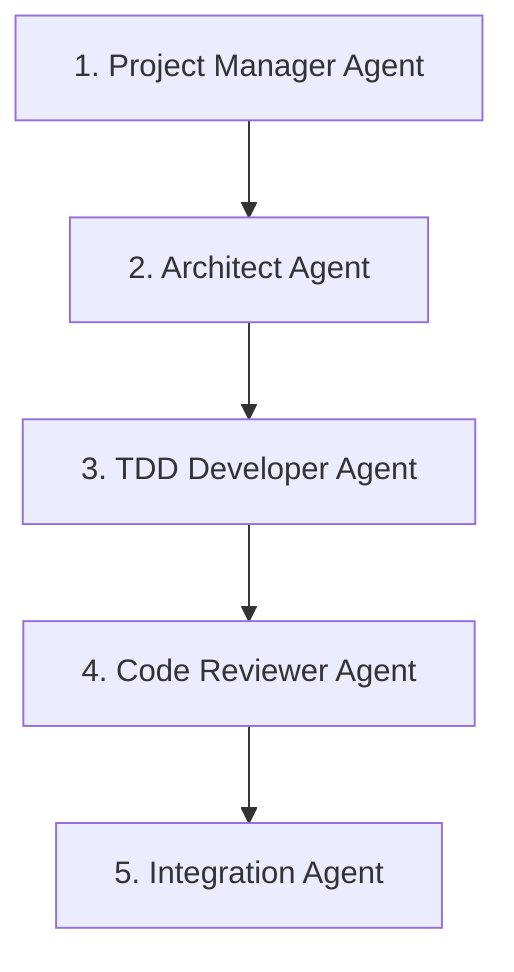

# Agentic Development Flow for CodeHive

## Core Philosophy: Test-Driven Agent Development

### 1. Specification-First Approach

```
Spec → Tests → Implementation → Review → Integration
```

Each agent should follow this cycle:

1. **Write Detailed Specification**
   - Clear acceptance criteria
   - Expected inputs/outputs
   - Error scenarios
   - Performance requirements

2. **Create Test Suite First**
   - Unit tests for parsing logic
   - Integration tests with mock Claude Code
   - End-to-end tests with real execution

3. **Implement Incrementally**
   - Build minimal working version
   - Add features one at a time
   - Validate against tests continuously

### 2. Agent Development Order



**Why this order?**

- Project Manager creates the work items
- Architect designs before coding
- TDD Developer implements
- Code Reviewer ensures quality
- Integration handles deployment

### 3. Agent Communication Pattern

```typescript
interface AgentContext {
  projectPath: string;
  previousAgents: AgentResult[];
  kanbanCard: KanbanCard;
  gitBranch: string;
}

interface AgentResult {
  success: boolean;
  output: string;
  artifacts: {
    files?: string[];
    tests?: TestResult[];
    commits?: string[];
  };
  nextSteps: string[];
}
```

### 4. Prompt Engineering Workflow

#### A. Iterative Prompt Development

```markdown
<!-- Version 1: Basic -->

You are a TDD developer. Write tests first.

<!-- Version 2: Contextual -->

You are a TDD developer for project {{PROJECT_NAME}}.
Task: {{TASK_DESCRIPTION}}
Write tests first, then implementation.

<!-- Version 3: Structured -->

You are a TDD developer agent for CodeHive.

Context:

- Project: {{PROJECT_NAME}}
- Task: {{TASK_DESCRIPTION}}
- Tech Stack: {{TECH_STACK}}
- Previous Work: {{PREVIOUS_AGENT_OUTPUT}}

Instructions:

1. Analyze the task requirements
2. Write comprehensive tests
3. Implement code to pass tests
4. Ensure code coverage > 80%

Output Format:

- List of created test files
- List of implementation files
- Test results summary
```

#### B. Prompt Testing Framework

```typescript
// lib/agents/testing/prompt-tester.ts
export async function testPrompt(
  promptTemplate: string,
  testCases: TestCase[]
) {
  for (const testCase of testCases) {
    const prompt = renderPrompt(promptTemplate, testCase.context);
    const result = await executeClaudeCode(prompt);

    // Validate output structure
    expect(result).toMatchSchema(AgentResultSchema);

    // Check specific outcomes
    expect(result.artifacts.tests).toHaveLength(testCase.expectedTests);
  }
}
```

### 5. Agent Capability Evolution

#### Phase 1: Basic Execution

- Simple prompt → Claude Code → capture output
- No context awareness
- Manual result parsing

#### Phase 2: Context-Aware

- Inject project context
- Parse structured outputs
- Track file changes

#### Phase 3: Multi-Step Workflows

- Chain multiple Claude Code calls
- Maintain conversation context
- Handle complex scenarios

#### Phase 4: Self-Correcting

- Detect errors in output
- Retry with corrections
- Learn from failures

### 6. Quality Assurance for Agents

```typescript
// Each agent must pass these gates:
interface AgentQualityGates {
  unitTests: {
    promptRendering: boolean;
    outputParsing: boolean;
    errorHandling: boolean;
  };
  integrationTests: {
    mockExecution: boolean;
    realExecution: boolean;
    chainedExecution: boolean;
  };
  performanceTests: {
    executionTime: number; // < 5 minutes
    tokenUsage: number; // < 50k tokens
    successRate: number; // > 90%
  };
}
```

### 7. Debugging Agent Behavior

```typescript
// lib/agents/debug.ts
export class AgentDebugger {
  // Log all prompts
  logPrompt(agent: string, prompt: string) {
    fs.writeFileSync(`logs/prompts/${agent}-${Date.now()}.md`, prompt);
  }

  // Record execution traces
  async traceExecution(agent: string, task: AgentTask) {
    const trace = {
      start: Date.now(),
      prompt: task.prompt,
      workingDir: task.workingDirectory,
      output: '',
      error: null,
      duration: 0,
    };

    try {
      trace.output = await executeAgent(task);
    } catch (error) {
      trace.error = error;
    }

    trace.duration = Date.now() - trace.start;
    await saveTrace(trace);
  }
}
```

### 8. Agent Orchestration Patterns

#### A. Sequential Execution

```typescript
// For dependent tasks
async function runSequential(agents: Agent[], context: Context) {
  let previousOutput = null;

  for (const agent of agents) {
    context.previousOutput = previousOutput;
    previousOutput = await agent.execute(context);

    if (!previousOutput.success) {
      break; // Stop on failure
    }
  }
}
```

#### B. Parallel Execution

```typescript
// For independent tasks
async function runParallel(agents: Agent[], context: Context) {
  const results = await Promise.all(
    agents.map(agent => agent.execute(context))
  );

  return mergeResults(results);
}
```

#### C. Conditional Execution

```typescript
// For dynamic workflows
async function runConditional(context: Context) {
  const analysis = await ProjectManagerAgent.analyze(context);

  if (analysis.needsArchitecture) {
    await ArchitectAgent.execute(context);
  }

  if (analysis.hasTests) {
    await TDDDeveloperAgent.execute(context);
  } else {
    await TestWriterAgent.execute(context);
  }
}
```

### 9. Continuous Improvement

1. **Collect Metrics**
   - Success rates per agent
   - Token usage patterns
   - Common failure modes

2. **Analyze Patterns**
   - Which prompts work best?
   - What context improves results?
   - Where do agents struggle?

3. **Iterate Prompts**
   - A/B test prompt variations
   - Refine based on metrics
   - Version control prompts

4. **Share Learning**
   - Document best practices
   - Create prompt templates
   - Build reusable patterns

### 10. Real-World Testing Strategy

```bash
# Test with increasing complexity
1. Hello World project
2. REST API with CRUD
3. Full-stack web app
4. Microservices system
5. Legacy code refactoring
```

Each level validates:

- Agent coordination
- Error recovery
- Performance limits
- Output quality

## Key Principles

1. **Fail Fast**: Detect issues early in the pipeline
2. **Observable**: Log everything for debugging
3. **Deterministic**: Same input → same output
4. **Composable**: Agents work independently and together
5. **Resilient**: Graceful handling of failures
