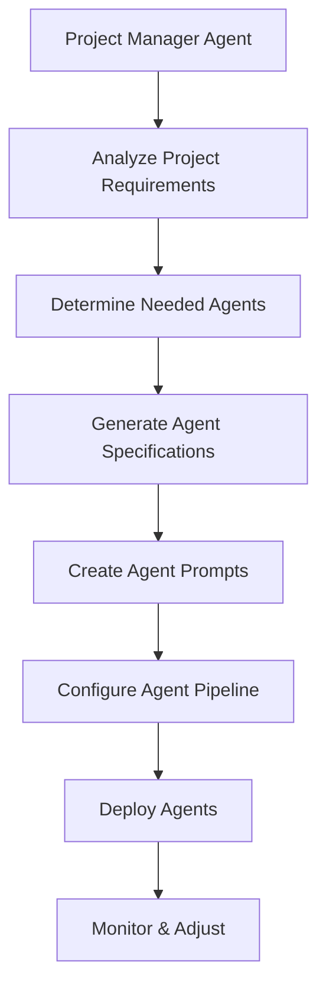

# Dynamic Agent System for CodeHive

## Overview

The Project Manager Agent in CodeHive has the capability to dynamically create and configure specialized agents based on project requirements. This allows for adaptive development workflows tailored to each project's unique needs.

## Architecture

### Agent Creation Flow



### Core Components

```typescript
// lib/agents/dynamic/agent-factory.ts
interface AgentSpecification {
  id: string;
  name: string;
  type: 'developer' | 'tester' | 'reviewer' | 'specialist';
  purpose: string;
  capabilities: string[];
  dependencies: string[]; // Other agents this one depends on
  prompt: string;
  constraints: {
    maxExecutionTime: number;
    maxTokens: number;
    requiredOutputs: string[];
  };
}

interface ProjectAgentConfiguration {
  projectId: string;
  agents: AgentSpecification[];
  pipeline: AgentPipeline;
  triggers: AgentTrigger[];
}
```

## Project Manager Agent Enhancement

### Analyzing Project Needs

```typescript
// lib/agents/project-manager/analyzer.ts
export class ProjectAnalyzer {
  async analyzeProjectNeeds(project: Project): Promise<ProjectAnalysis> {
    const analysis = {
      projectType: await this.detectProjectType(project),
      techStack: await this.detectTechStack(project),
      complexity: await this.assessComplexity(project),
      specialRequirements: await this.findSpecialRequirements(project),
    };

    return analysis;
  }

  private async detectProjectType(project: Project): Promise<ProjectType> {
    // Analyze repository structure, dependencies, and documentation
    const files = await this.scanProjectFiles(project.path);

    if (files.includes('package.json')) {
      const pkg = await this.readPackageJson(project.path);
      if (pkg.dependencies?.['react']) return 'react-app';
      if (pkg.dependencies?.['express']) return 'node-api';
    }

    if (files.includes('requirements.txt')) return 'python-app';
    if (files.includes('Cargo.toml')) return 'rust-app';

    return 'generic';
  }
}
```

### Dynamic Agent Generation

```typescript
// lib/agents/project-manager/agent-generator.ts
export class AgentGenerator {
  async generateAgentsForProject(
    analysis: ProjectAnalysis
  ): Promise<AgentSpecification[]> {
    const baseAgents = this.getBaseAgents();
    const specializedAgents = await this.createSpecializedAgents(analysis);

    return [...baseAgents, ...specializedAgents];
  }

  private async createSpecializedAgents(
    analysis: ProjectAnalysis
  ): Promise<AgentSpecification[]> {
    const agents: AgentSpecification[] = [];

    // React projects need component specialists
    if (analysis.projectType === 'react-app') {
      agents.push({
        id: 'react-component-agent',
        name: 'React Component Specialist',
        type: 'specialist',
        purpose: 'Create and optimize React components',
        capabilities: [
          'Create functional components with hooks',
          'Implement proper prop typing',
          'Optimize re-renders',
          'Write component tests',
        ],
        dependencies: ['tdd-developer'],
        prompt: await this.generateReactAgentPrompt(analysis),
        constraints: {
          maxExecutionTime: 300000,
          maxTokens: 50000,
          requiredOutputs: ['component', 'tests', 'types'],
        },
      });
    }

    // API projects need endpoint specialists
    if (analysis.projectType === 'node-api') {
      agents.push({
        id: 'api-endpoint-agent',
        name: 'API Endpoint Specialist',
        type: 'specialist',
        purpose: 'Design and implement RESTful endpoints',
        capabilities: [
          'Create CRUD endpoints',
          'Implement authentication',
          'Add input validation',
          'Generate API documentation',
        ],
        dependencies: ['architect'],
        prompt: await this.generateAPIAgentPrompt(analysis),
        constraints: {
          maxExecutionTime: 300000,
          maxTokens: 50000,
          requiredOutputs: ['endpoints', 'tests', 'docs'],
        },
      });
    }

    // Projects with databases need migration specialists
    if (analysis.specialRequirements.includes('database')) {
      agents.push({
        id: 'database-migration-agent',
        name: 'Database Migration Specialist',
        type: 'specialist',
        purpose: 'Manage database schema and migrations',
        capabilities: [
          'Create migration files',
          'Design efficient schemas',
          'Handle rollbacks',
          'Optimize queries',
        ],
        dependencies: ['architect'],
        prompt: await this.generateDatabaseAgentPrompt(analysis),
        constraints: {
          maxExecutionTime: 180000,
          maxTokens: 30000,
          requiredOutputs: ['migrations', 'models'],
        },
      });
    }

    return agents;
  }
}
```

## Agent Prompt Templates

### Dynamic Prompt Generation

```typescript
// lib/agents/prompts/dynamic-prompt-builder.ts
export class DynamicPromptBuilder {
  async buildPrompt(
    agentSpec: AgentSpecification,
    projectContext: ProjectContext
  ): Promise<string> {
    const template = await this.getBaseTemplate(agentSpec.type);

    return this.interpolate(template, {
      agentName: agentSpec.name,
      purpose: agentSpec.purpose,
      capabilities: agentSpec.capabilities.join('\n- '),
      projectName: projectContext.name,
      techStack: projectContext.techStack,
      workingDirectory: projectContext.path,
      constraints: this.formatConstraints(agentSpec.constraints),
      outputFormat: this.generateOutputFormat(agentSpec.requiredOutputs),
    });
  }

  private generateOutputFormat(requiredOutputs: string[]): string {
    const format: any = {};

    for (const output of requiredOutputs) {
      switch (output) {
        case 'component':
          format.components = {
            files: [],
            exports: [],
          };
          break;
        case 'tests':
          format.tests = {
            files: [],
            coverage: {},
          };
          break;
        case 'endpoints':
          format.endpoints = {
            routes: [],
            middleware: [],
          };
          break;
      }
    }

    return JSON.stringify(format, null, 2);
  }
}
```

### Example: Generated React Component Agent Prompt

```markdown
You are a React Component Specialist agent for CodeHive.

Project: {{projectName}}
Working Directory: {{workingDirectory}}
Tech Stack: {{techStack}}

Your Purpose:
{{purpose}}

Your Capabilities:
{{capabilities}}

Task Context:
{{taskDescription}}

Requirements:

1. Create functional components using React hooks
2. Implement proper TypeScript typing for all props
3. Follow the project's component structure in {{workingDirectory}}/src/components
4. Write comprehensive tests using the project's testing framework
5. Ensure components are accessible (ARIA attributes)
6. Optimize for performance (memo, useMemo, useCallback where appropriate)

Previous Work:
{{previousAgentOutput}}

Constraints:
{{constraints}}

Output Format:
{{outputFormat}}
```

## Agent Pipeline Configuration

### Dynamic Pipeline Builder

```typescript
// lib/agents/pipeline/dynamic-pipeline.ts
export class DynamicPipelineBuilder {
  async buildPipeline(
    agents: AgentSpecification[],
    project: Project
  ): Promise<AgentPipeline> {
    // Sort agents by dependencies
    const sorted = this.topologicalSort(agents);

    // Create execution stages
    const stages = this.createStages(sorted);

    // Add conditional logic
    const pipeline = this.addConditionals(stages, project);

    return pipeline;
  }

  private createStages(agents: AgentSpecification[]): PipelineStage[] {
    const stages: PipelineStage[] = [];
    let currentStage: AgentSpecification[] = [];

    for (const agent of agents) {
      // Agents with no dependencies can run in parallel
      if (agent.dependencies.length === 0) {
        currentStage.push(agent);
      } else {
        // Start new stage if dependencies exist
        if (currentStage.length > 0) {
          stages.push({
            agents: currentStage,
            parallel: true,
          });
          currentStage = [];
        }
        stages.push({
          agents: [agent],
          parallel: false,
        });
      }
    }

    if (currentStage.length > 0) {
      stages.push({
        agents: currentStage,
        parallel: true,
      });
    }

    return stages;
  }
}
```

## Runtime Agent Management

### Agent Lifecycle Manager

```typescript
// lib/agents/runtime/lifecycle-manager.ts
export class AgentLifecycleManager {
  private activeAgents = new Map<string, RuntimeAgent>();

  async deployAgent(spec: AgentSpecification): Promise<RuntimeAgent> {
    // Create runtime instance
    const agent = new RuntimeAgent(spec);

    // Initialize with prompt
    await agent.initialize();

    // Register for monitoring
    this.activeAgents.set(spec.id, agent);

    // Start health checks
    this.startHealthChecks(agent);

    return agent;
  }

  async updateAgent(
    agentId: string,
    updates: Partial<AgentSpecification>
  ): Promise<void> {
    const agent = this.activeAgents.get(agentId);
    if (!agent) throw new Error(`Agent ${agentId} not found`);

    // Update specification
    await agent.updateSpec(updates);

    // Regenerate prompt if needed
    if (updates.prompt || updates.capabilities) {
      await agent.regeneratePrompt();
    }
  }

  async retireAgent(agentId: string): Promise<void> {
    const agent = this.activeAgents.get(agentId);
    if (!agent) return;

    // Graceful shutdown
    await agent.shutdown();

    // Remove from active agents
    this.activeAgents.delete(agentId);
  }
}
```

## Self-Improving System

### Agent Performance Analyzer

```typescript
// lib/agents/analytics/performance-analyzer.ts
export class AgentPerformanceAnalyzer {
  async analyzeAgentPerformance(
    agentId: string,
    timeframe: TimeFrame
  ): Promise<PerformanceReport> {
    const metrics = await this.collectMetrics(agentId, timeframe);

    return {
      successRate: this.calculateSuccessRate(metrics),
      avgExecutionTime: this.calculateAvgTime(metrics),
      tokenEfficiency: this.calculateTokenEfficiency(metrics),
      recommendations: await this.generateRecommendations(metrics),
    };
  }

  private async generateRecommendations(
    metrics: AgentMetrics[]
  ): Promise<string[]> {
    const recommendations: string[] = [];

    // Check for consistent failures
    const failurePatterns = this.findFailurePatterns(metrics);
    if (failurePatterns.length > 0) {
      recommendations.push(
        `Agent fails consistently on: ${failurePatterns.join(', ')}`
      );
    }

    // Check for inefficient token usage
    const avgTokens = this.calculateAvgTokens(metrics);
    if (avgTokens > 40000) {
      recommendations.push(
        'Consider splitting tasks or optimizing prompts to reduce token usage'
      );
    }

    // Check for slow execution
    const avgTime = this.calculateAvgTime(metrics);
    if (avgTime > 240000) {
      // 4 minutes
      recommendations.push(
        'Agent execution time is high, consider parallelization'
      );
    }

    return recommendations;
  }
}
```

## Example: Project-Specific Agent Creation

### For a Microservices Project

```typescript
// When Project Manager analyzes a microservices project
const microserviceAgents = [
  {
    id: 'service-boundary-agent',
    name: 'Service Boundary Designer',
    purpose: 'Define clear service boundaries and interfaces',
  },
  {
    id: 'api-contract-agent',
    name: 'API Contract Specialist',
    purpose: 'Design and maintain service contracts',
  },
  {
    id: 'distributed-testing-agent',
    name: 'Distributed Testing Specialist',
    purpose: 'Create integration tests across services',
  },
  {
    id: 'deployment-orchestration-agent',
    name: 'Deployment Orchestrator',
    purpose: 'Manage multi-service deployments',
  },
];
```

### For a Machine Learning Project

```typescript
// When Project Manager detects ML requirements
const mlAgents = [
  {
    id: 'data-pipeline-agent',
    name: 'Data Pipeline Engineer',
    purpose: 'Build data preprocessing pipelines',
  },
  {
    id: 'model-training-agent',
    name: 'Model Training Specialist',
    purpose: 'Train and optimize ML models',
  },
  {
    id: 'experiment-tracking-agent',
    name: 'Experiment Tracker',
    purpose: 'Track experiments and metrics',
  },
  {
    id: 'model-deployment-agent',
    name: 'Model Deployment Specialist',
    purpose: 'Deploy models to production',
  },
];
```

## Configuration Storage

### Database Schema for Dynamic Agents

```sql
-- Dynamic agent specifications
CREATE TABLE agent_specifications (
  id TEXT PRIMARY KEY,
  project_id TEXT NOT NULL,
  name TEXT NOT NULL,
  type TEXT NOT NULL,
  purpose TEXT NOT NULL,
  capabilities JSON NOT NULL,
  dependencies JSON NOT NULL,
  prompt TEXT NOT NULL,
  constraints JSON NOT NULL,
  created_at DATETIME DEFAULT CURRENT_TIMESTAMP,
  updated_at DATETIME DEFAULT CURRENT_TIMESTAMP,
  created_by TEXT DEFAULT 'project-manager-agent',
  FOREIGN KEY (project_id) REFERENCES projects(id) ON DELETE CASCADE
);

-- Agent performance metrics
CREATE TABLE agent_performance (
  id TEXT PRIMARY KEY,
  agent_id TEXT NOT NULL,
  execution_time INTEGER NOT NULL,
  tokens_used INTEGER NOT NULL,
  success BOOLEAN NOT NULL,
  error_message TEXT,
  task_complexity TEXT,
  timestamp DATETIME DEFAULT CURRENT_TIMESTAMP,
  FOREIGN KEY (agent_id) REFERENCES agent_specifications(id) ON DELETE CASCADE
);

-- Agent evolution history
CREATE TABLE agent_evolution (
  id TEXT PRIMARY KEY,
  agent_id TEXT NOT NULL,
  version INTEGER NOT NULL,
  changes JSON NOT NULL,
  performance_before JSON NOT NULL,
  performance_after JSON,
  reason TEXT NOT NULL,
  timestamp DATETIME DEFAULT CURRENT_TIMESTAMP,
  FOREIGN KEY (agent_id) REFERENCES agent_specifications(id) ON DELETE CASCADE
);
```

## Benefits of Dynamic Agent System

1. **Adaptability**: Agents tailored to specific project needs
2. **Efficiency**: Only create agents that are actually needed
3. **Scalability**: Add new agent types without code changes
4. **Learning**: System improves over time based on performance
5. **Flexibility**: Easy to experiment with new agent configurations
